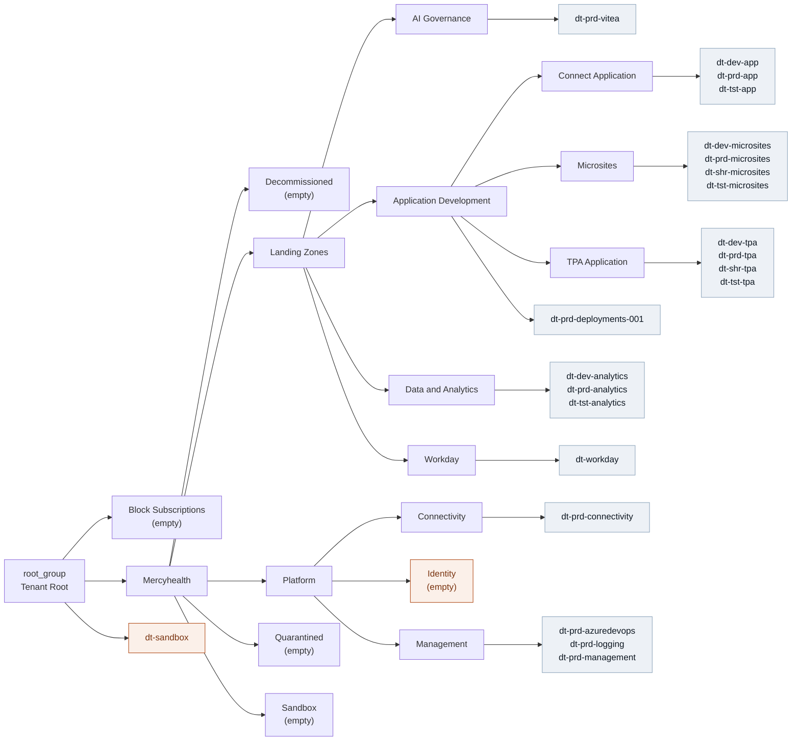

# Mercyhealth Azure Tenant — Management Group & Subscription Hierarchy

**Prepared:** 2026-09-03 15:30 UTC
**Prepared by:** Claude Code session, workspace `D:\codes\Azure`
**Class:** 0 — read-only discovery. No Azure or Azure DevOps object was created, modified, or deleted.

---

## 1. Scope and context

| Item | Value |
|---|---|
| Tenant | Mercyhealth — `mh.mercyhealthcare.org` |
| Signed-in identity | `hdesai@mhemail.org` |
| Auth method | Existing Azure CLI login (az 2.89.1) |
| Management groups | 18 (incl. tenant root) |
| Subscriptions | 22 — all `Enabled` |
| Deepest MG path | 4 levels below root (ceiling is root + 6) |

Tenant and subscription GUIDs are intentionally omitted from this file — `.gitignore` does not
exclude `Output/`, and CLAUDE.md §6.2 prohibits committing them. Raw ID-bearing JSON was written
only to the session scratchpad, outside the repository.

## 2. Evidence collected

| # | Command | Result |
|---|---|---|
| 1 | `az account show` | Confirmed tenant + identity |
| 2 | `az account list --all` | 22 subscriptions, all Enabled |
| 3 | `az account management-group list` | **Failed** — `AuthorizationFailed` on `Microsoft.Management/register/action` |
| 4 | `az rest GET .../managementGroups?api-version=2021-04-01` | 18 MGs |
| 5 | `az rest GET .../managementGroups/{root}/descendants?api-version=2021-04-01` | 39 nodes (17 MG + 22 sub) with parent edges |

**On step 3 to 4.** The first-party CLI command failed because its wrapper attempts an RP
registration this account is not authorised for. The underlying Management Groups API needs no
such registration, so the direct REST call succeeds and returns the same data. This is the
documented CLAUDE.md §7.4 exception for `az rest` — no working first-party command exists for
this operation at this permission level.

**Completeness check.** The 22 subscriptions in the descendants tree reconcile exactly against
`az account list --all` (zero-diff `Compare-Object`). Nothing visible to this account is missing
from the tree. Management groups this account cannot read would not appear at all, so absence is
not proof of non-existence.

## 3. Hierarchy (Confirmed)

```text
root_group  (Tenant Root)
├── Block Subscriptions                        [block_subscriptions]              (empty)
├── Mercyhealth                                [mercyhealth]
│   ├── Decommissioned                         [mercyhealth-decommissioned]       (empty)
│   ├── Landing Zones                          [mercyhealth-landingzones]
│   │   ├── AI Governance                      [...-ai-governance]
│   │   │   └── dt-prd-vitea-oeqrq2jxadm36
│   │   ├── Application Development            [...-appdev]
│   │   │   ├── Connect Application            [...-appdev-connect]
│   │   │   │   ├── dt-dev-app-oeqrq2jxadm36
│   │   │   │   ├── dt-prd-app-oeqrq2jxadm36
│   │   │   │   └── dt-tst-app-oeqrq2jxadm36
│   │   │   ├── Microsites                     [...-appdev-microsites]
│   │   │   │   ├── dt-dev-microsites-oeqrq2jxadm36
│   │   │   │   ├── dt-prd-microsites-oeqrq2jxadm36
│   │   │   │   ├── dt-shr-microsites-oeqrq2jxadm36
│   │   │   │   └── dt-tst-microsites-oeqrq2jxadm36
│   │   │   ├── TPA Application                [...-appdev-tpa]
│   │   │   │   ├── dt-dev-tpa-oeqrq2jxadm36
│   │   │   │   ├── dt-prd-tpa-oeqrq2jxadm36
│   │   │   │   ├── dt-shr-tpa-oeqrq2jxadm36
│   │   │   │   └── dt-tst-tpa-oeqrq2jxadm36
│   │   │   └── dt-prd-deployments-001                    <-- sub directly on MG
│   │   ├── Data and Analytics                 [...-dna]
│   │   │   ├── dt-dev-analytics-oeqrq2jxadm36
│   │   │   ├── dt-prd-analytics-oeqrq2jxadm36
│   │   │   └── dt-tst-analytics-oeqrq2jxadm36
│   │   └── Workday                            [...-workday]
│   │       └── dt-workday-oeqrq2jxadm36
│   ├── Platform                               [mercyhealth-platform]
│   │   ├── Connectivity                       [...-platform-connectivity]
│   │   │   └── dt-prd-connectivity-oeqrq2jxadm36
│   │   ├── Identity                           [...-platform-identity]            (empty)
│   │   └── Management                         [...-platform-management]
│   │       ├── dt-prd-azuredevops-oeqrq2jxadm36
│   │       ├── dt-prd-logging-oeqrq2jxadm36
│   │       └── dt-prd-management-oeqrq2jxadm36
│   ├── Quarantined                            [mercyhealth-quarantined]          (empty)
│   └── Sandbox                                [mercyhealth-sandbox]              (empty)
└── dt-sandbox                                             <-- ROOT-ATTACHED
```

## 4. Mermaid view



## 5. Findings

| # | Finding | Label | Basis |
|---|---|---|---|
| 1 | `dt-sandbox` is attached to the tenant root, not the (empty) Sandbox MG. It inherits no policy from the `Mercyhealth` branch. | Confirmed | Descendants API parent edge |
| 2 | `Identity` platform MG holds no subscription, while Connectivity and Management both do. | Confirmed | Descendants API |
| 3 | `Block Subscriptions`, `Decommissioned`, `Quarantined` are empty. | Confirmed | Descendants API |
| 4 | `dt-prd-deployments-001` breaks the `-oeqrq2jxadm36` naming convention and sits directly on Application Development. | Confirmed | Subscription list + parent edge |
| 5 | Deepest path is 4 MG levels below root; CAF recommends 3–4, hard ceiling is root + 6. | Confirmed | Tree + MS Learn |
| 6 | Workload grouping is inconsistent — appdev nests per-workload MGs, DnA is flat. | Confirmed | Tree shape |
| 7 | Finding 1 is the only item with a governance consequence today. | Inferred | Follows from 1 |

### Interpretation of finding 1

New subscriptions land under the tenant root by default, which is the ordinary cause. Moving
`dt-sandbox` under the Sandbox MG is a control-plane metadata move that does not touch resources,
**but it changes which policies apply to it** — so it is not a no-op and must not be treated as
one. Any move should be preceded by a review of the policy assignments on `mercyhealth-sandbox`.

## 6. Not covered

Policy assignments, initiatives, exemptions and compliance state; RBAC and PIM; resource
inventory within subscriptions; cost; Defender posture; subscription-to-billing-account mapping.
None of these were queried. No recommendation in this document is authorised for execution.

## 7. Reproduce

```powershell
az account show -o json
az account list --all -o json
az rest --method get --url "https://management.azure.com/providers/Microsoft.Management/managementGroups?api-version=2021-04-01"
az rest --method get --url "https://management.azure.com/providers/Microsoft.Management/managementGroups/<tenantId>/descendants?api-version=2021-04-01"
```

All four are read-only.
