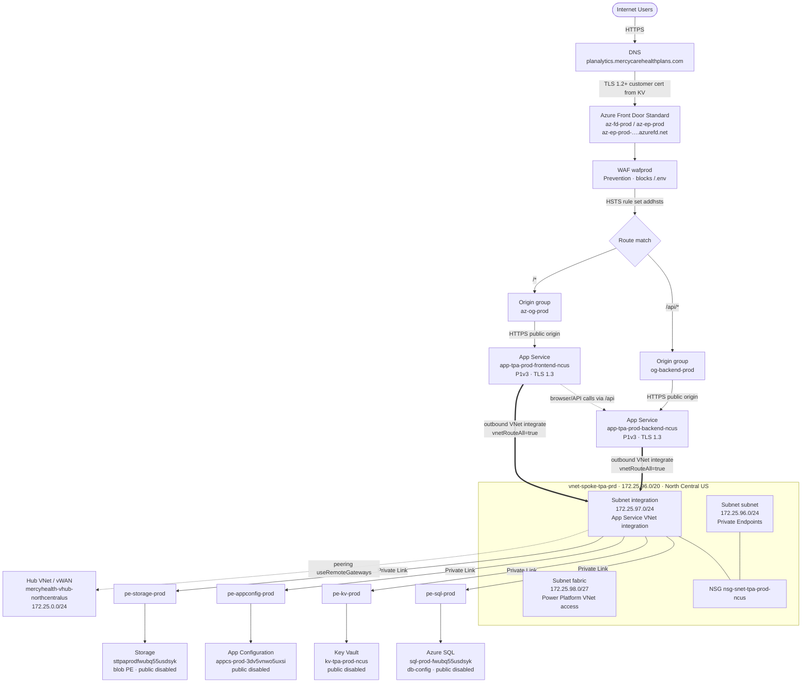

# Chat conversation export

- **Workspace:** `E:\azdevops\Azure`
- **Session ID:** `bc12bf2d-0963-459a-a8b5-4b906390d4a0`
- **Date:** Monday, Jul 20, 2026
- **Note:** User and assistant messages only (tool calls omitted for readability).

---

## Turn 1

### User

refer to this file D:\adorepos\microsites\.cursor\mcp.json, copy its contents to a new file and also add Azure MCP to this file.

### Assistant

Created `E:\azdevops\Azure\.cursor\mcp.json` with the microsites MCP servers plus Azure MCP.

Copied: `ado`, `lucid`, `microsoft-learn`, `bicep`

Added:

```json
"Azure MCP Server": {
  "command": "C:\\Program Files\\nodejs\\npx.cmd",
  "args": ["-y", "@azure/mcp@latest", "server", "start"]
}
```

Uses the same full `npx.cmd` path as your other Node-based servers. Reload MCP in Cursor (Settings → Tools & MCP) if it doesn’t show up right away.

---

## Turn 2

### User

How to login to Azure using this MCP

### Assistant

Azure MCP does **not** have its own separate login. It reuses credentials from tools already signed in on your machine (Azure CLI, Azure Developer CLI, VS Code, etc.).

### 1. Sign in with Azure CLI (recommended)

```powershell
az login
```

That opens a browser for Microsoft Entra ID. Then confirm the account/subscription:

```powershell
az account show
```

To pick a specific subscription:

```powershell
az account list --output table
az account set --subscription "<subscription-id-or-name>"
```

### 2. Use Azure MCP in Cursor

Once `az login` succeeds and the Azure MCP server is enabled in **Settings → Tools & MCP**, ask something like:

> List my Azure resource groups

If Cursor still asks you to authenticate, run the auth tool it suggests (browser sign-in). If you’re already logged in via Azure CLI, it usually won’t prompt.

### Notes

- Your account needs RBAC on the resources you want to use (e.g. Reader, Contributor, or service-specific roles).
- Resources must already exist in the subscription — MCP uses your identity to call Azure APIs.

Docs: [Get started with Azure MCP in Cursor](https://learn.microsoft.com/en-us/azure/developer/azure-mcp-server/get-started/tools/cursor)

---

## Turn 3

### User

List my Azure resource groups

### Assistant

You're signed in, but neither subscription is marked as default. Which one should I use?

1. **Pay-As-You-Go-10032025** (`0b2b0216-aa7b-4634-8ab9-f337ea6cd665`)
2. **Default-PAYG** (`e25ead96-5cb0-4416-a478-ad9f4242a8c3`)

Or I can list resource groups in both.

---

## Turn 4

### User

I want to login to a different tenant, as shown in the image. I want to get contents from this attached Azure tenant

*(Attached: `az account show` screenshot for Mercyhealth tenant / subscription `dt-tst-microsites-oeqrq2jxadm36`)*

### Assistant

Connected to the **Mercyhealth** tenant and listed resource groups from your default subscription.

**Tenant:** Mercyhealth (`7d689bf5-26f6-44a2-b080-61689eff65a6`)  
**Subscription:** `dt-tst-microsites-oeqrq2jxadm36` (`93ad3e04-0e66-411e-a795-c73bc4a1cf71`)

| Resource group | Location |
|---|---|
| `rg-spoke-microsites-tst-u3j7ej7gv6qcg` | northcentralus |
| `rg-asc-export-alz` | northcentralus |
| `NetworkWatcherRG` | northcentralus |

That tenant has many other subscriptions (app, analytics, tpa, connectivity, etc.). Say which subscription or resource group you want next.

---

## Turn 5

### User

what is the last month cost for all the dev subscriptions

### Assistant

**June 2026** ActualCost for all Mercyhealth `dt-dev-*` subscriptions totals **$5,774.67**.

| Subscription | Cost (USD) |
|---|---|
| `dt-dev-analytics-oeqrq2jxadm36` | $5,008.80 |
| `dt-dev-app-oeqrq2jxadm36` | $440.15 |
| `dt-dev-tpa-oeqrq2jxadm36` | $311.31 |
| `dt-dev-microsites-oeqrq2jxadm36` | $14.41 |

Analytics alone is ~87% of the spend. Open [dev subscriptions June cost](C:\Users\tiger\.cursor\projects\e-azdevops-Azure\canvases\dev-subscriptions-june-cost.canvas.tsx) beside the chat for charts and a full breakdown — canvases are live visual panels for this kind of billing data.

---

## Turn 6

### User

Which resources in analytics are burning more $$

### Assistant

**Microsoft Fabric Capacity** is the spend — not the deployed app resources.

For June 2026 in `dt-dev-analytics-oeqrq2jxadm36`:

| Driver | Cost | Share |
|---|---|---|
| **Fabric Capacity CU** (reservation purchase `2f116512-…`) | **$5,002.24** | **99.9%** |
| Defender for Cloud (ARM) | $4.97 | ~0.1% |
| Storage `stpmminvoiceimages` | $1.60 | ~0.03% |

The VNet, alerts, and Network Watcher in this subscription barely show up on the bill. The charge is a Fabric Capacity CU **purchase**, not pay-as-you-go usage of those ARM resources.

Open [analytics cost drivers](C:\Users\tiger\.cursor\projects\e-azdevops-Azure\canvases\analytics-cost-drivers.canvas.tsx) for the full breakdown.

---

## Turn 7

### User

What is the SKU of Fabric Capacity CU?

### Assistant

The reservation SKU is **`Fabric_Capacity_CU_Hour`**, with **quantity 64** — that maps to a Fabric **F64** capacity (64 CUs).

| Field | Value |
|---|---|
| Reservation SKU | `Fabric_Capacity_CU_Hour` |
| Quantity | 64 CUs → **F64** |
| Product | Fabric Capacity Reservation – US North Central |
| Display name | `FabricCapacity_01-01-2025_10-55` |
| Term | 1 year (`P1Y`), billed monthly |
| Region | North Central US |
| Scope | Shared |
| Utilization | 100% (1 / 7 / 30 day) |

No Fabric capacity ARM resource is in `dt-dev-analytics` itself — only the reservation purchase is billed there. The capacity it’s covering is likely in another subscription under the shared scope.

---

## Turn 8

### User

There is a subscription named dt-prd-tpa-oeqrq2jxadm36 - can you show me the end to end traffic flow starting from internet across all the resources in Azure.

### Assistant

End-to-end traffic for **MercyCare TPA prod** (`dt-prd-tpa-oeqrq2jxadm36` / `rg-spoke-tpa-prd-imkltpplo5qyg`):

### Primary path (Internet → app)



### What actually happens, hop by hop

1. **Internet** → `planalytics.mercycarehealthplans.com` → **Front Door** (`az-fd-prod`, Standard).
2. **WAF** (`wafprod`, Prevention) inspects traffic; custom rule blocks `/.env`. No OWASP managed rule sets attached.
3. **Routing**
   - `/api/*` → backend App Service `app-tpa-prod-backend-ncus`
   - `/*` → frontend App Service `app-tpa-prod-frontend-ncus`
4. Front Door reaches origins over the **public App Service hostnames** (no Private Link / Shared Private Link to the apps). Both apps have `publicNetworkAccess: Enabled` and IP restrictions currently **Allow all**.
5. Both apps are VNet-integrated into subnet `integration` with **route all** enabled, so outbound dependency traffic goes through the spoke VNet.
6. From the VNet, apps reach PaaS over **private endpoints** in subnet `subnet`:
   - SQL (`db-config`) — public access disabled  
   - Key Vault, App Configuration, Storage (blob) — public access disabled  
7. Spoke is **peered to the hub/vWAN** (`useRemoteGateways: true`) for hub-routed / hybrid connectivity. A `fabric` subnet exists for Power Platform VNet access.

### Supporting (not on the user request path)

| Resource | Role |
|---|---|
| `asp-tpa-prod-ncus` (P1v3) | Hosts frontend + backend |
| `ai-prod` / `log-prod` | App Insights + Log Analytics |
| Metric alerts + `ag-monitor` | Response time / CPU alerts |
| `id-prod` | User-assigned managed identity |
| `ExportToWorkspace` | Defender ASC export (separate RG) |

**Security note:** Front Door is the intended edge, but App Services are still publicly reachable by hostname today (no FD-only access restriction / Private Link). PaaS data plane (SQL/KV/App Config/Storage) is locked to private endpoints.

---

## Turn 9

### User

Generate the diagram in an HTML page and save the HTML page at the current location.

### Assistant

Saved to `E:\azdevops\Azure\dt-prd-tpa-traffic-flow.html`.

It includes the Mermaid traffic-flow diagram, hop-by-hop notes, the security callout, and supporting resources. Open the file in a browser (needs network once for the Mermaid CDN).

---

## Turn 10

### User

Save all the chat conversations to a .md file in the repo root.

### Assistant

Exported this conversation to `chat-conversation.md` in the repository root (`E:\azdevops\Azure\chat-conversation.md`).
